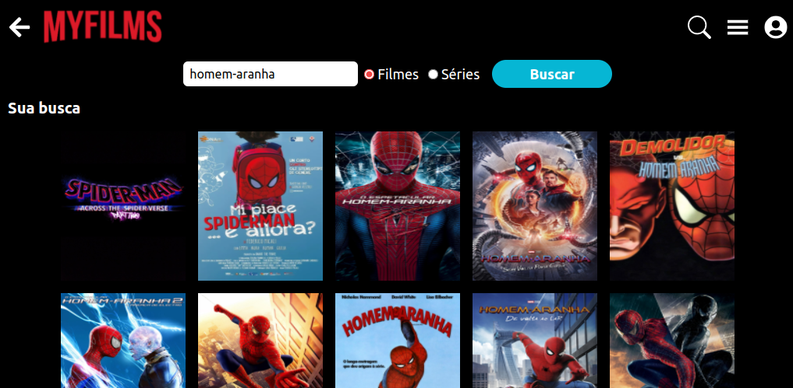

# MyFilms

Este projeto foi inspirado no designe da nossa queridinha [Netflix](https://www.netflix.com/br/). O resultado me deixou muito feliz, mesmo ainda tendo muito o que melhorar e desenvolver. Foi algo que levou mais tempo que o planejado mas acabou saindo com essa carinha mais profissional e isso deu um ânimo para ver minhas capacidades. Foram dias pensando em soluções mais apropriadas para cada funcionalidade e ver o resultado construído até então é satisfatório demais. Link para conferir o [MyFilms](https://myfilms.rodrigolimajesus.vercel.app/).

O projeto foi feito em React Js, para o gerenciamento de estados globais foi feito o uso de Context Api, e para a estilização foi usado o Tailwind CSS.

Abaixo é possível ver algumas das telas já feitas, lembrando que o projeto ainda não está concluído então algumas telas e/ou funcionalidades ainda podem não estar funcionando.

## Página Inicial

## Página de detalhes

## Página de busca

### Feedbacks são muito bem vindos, sem eles tenho certeza que eu não conseguiria ter me desenvolvido até aqui, fiquem a vontade para contribuir!!
